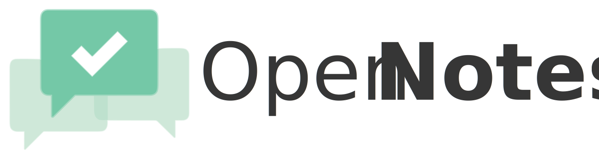

<h1 align="center">
The Philosophy Behind

</h1>

[Homepage](https://opennotes.ai) • [Philosophy](docs/PHILOSOPHY.md) • [Architecture](docs/ARCHITECTURE.md)

- [Community](#community)
- [Identity](#identity)
- [AI](#ai)

## Community

### Community Stewardship

Community owners, managers, and moderators are often thought of primarily as the people who ban bad actors and delete spam. But that framing undersells the role. These people are stewards of a social environment. Beyond curtailing harmful behavior, they shape what the community *is*: its tone, its norms, its implicit rules of engagement.

This matters because norms vary. Some communities are deliberately freewheeling, where calls for decorum are themselves the disruption. Others maintain nuanced codes of conduct. Both are legitimate.

In physical spaces, we have subtle mechanisms for norm enforcement[^social-cues]: a look, a shift in tone, a gentle redirect. These provide correction without derailing the conversation. Online, meta-discussions about norms tend to consume the discussions they're meant to protect. Communities should be able to reflect on how they want to operate, but not at the expense of operating.

The Community Notes algorithm encodes a specific set of discourse preferences mathematically. But we don't believe there's a universal correct configuration. Community stewards should have meaningful control over the parameters, such as how much weight to give a member's global voting history versus their behavior within this specific community.

[^social-cues]: Social cues which the author often has trouble noticing.

### Community Agency

Even the degree to which bridging-based ranking is employed should be a community choice.

Communities should have wide latitude to organize themselves as they see fit, provided participation is voluntary and alternatives exist.

The calculus shifts as a community approaches a general commons. The more a space functions as shared infrastructure, the more important bridging approaches become. Without them, we see familiar failure modes at scale: polarization, groupthink, or heavy-handed moderation that creates its own problems.

The guideline: greater autonomy for clearly bounded communities; stronger defaults for spaces that function as public infrastructure.

### Moderation

Moderation has historically taken two forms: unpaid volunteers in small communities, paid operations staff at scale. Both models concentrate judgment in few hands.

A better approach distributes this responsibility. Community-driven moderation decentralizes control, spreads labor, and aligns incentives with the people who actually inhabit these spaces. This is the direction we're building toward.

## Identity

By default, we want all votes and notes within a community to be auditable by its members. Transparency is foundational to trust.

But transparency creates tension with honest participation. People may hesitate to share reasonable but unpopular perspectives if those positions can be traced to their real identities.

Stable pseudonyms offer a middle path: the safety of anonymity with the accountability of a consistent, recognizable identity. A pseudonymous contributor isn't just an anonymous data point, but someone with a history others can evaluate.

## AI

### AI in Communities

Communities should always control how AI participates in their discourse, if it participates at all.

AI is particularly useful for the cold start problem: when someone requests a note and none exists, AI can draft the content. Rather than replacing human judgment, this removes a barrier to it.

A possibility to explore in the future is AI-assisted voting. Notes sometimes languish without sufficient ratings, even when someone cared enough to request them and someone else wrote them. AI could help surface these neglected items.

All such capabilities must be opt-in and configurable. We're building tools communities can choose to adopt, not defaults they have to fight against.

### AI Discourse and Coordination

The same properties that make bridging-based algorithms useful in human discourse can help coordinate AI agents, as long as once can meaningfully associate an "identity"[^ai-identity] with a voting history.

[^ai-identity]: To start, a `prompt, model+version, temperature` tuple seems like a potentially appropriate analogue.
