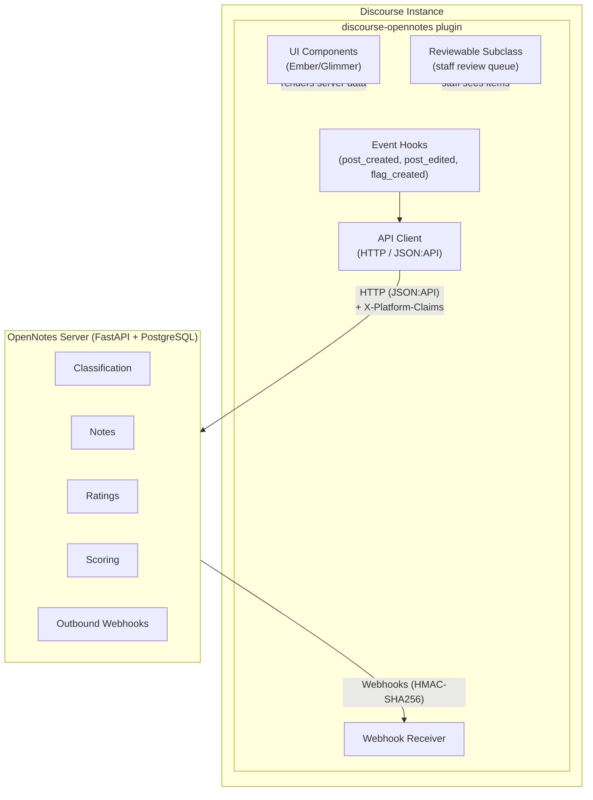
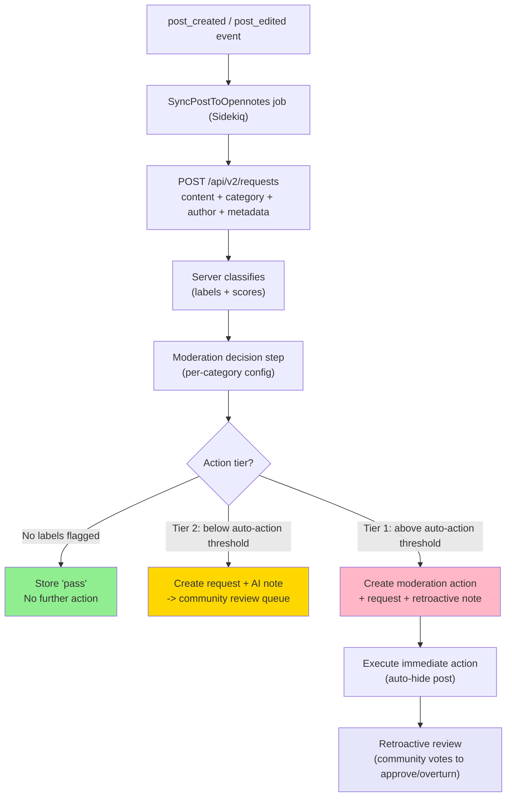
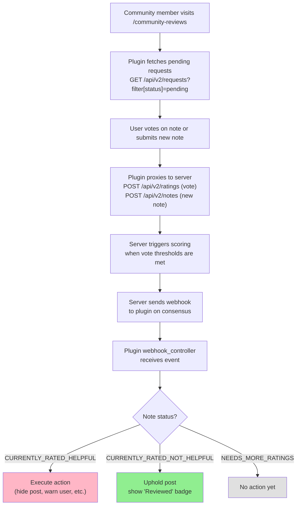
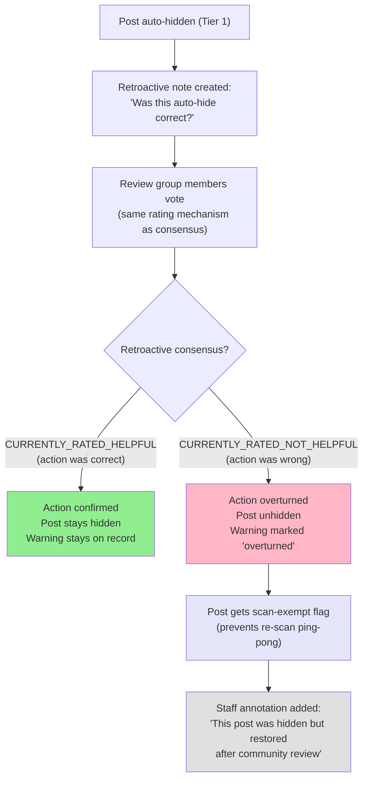
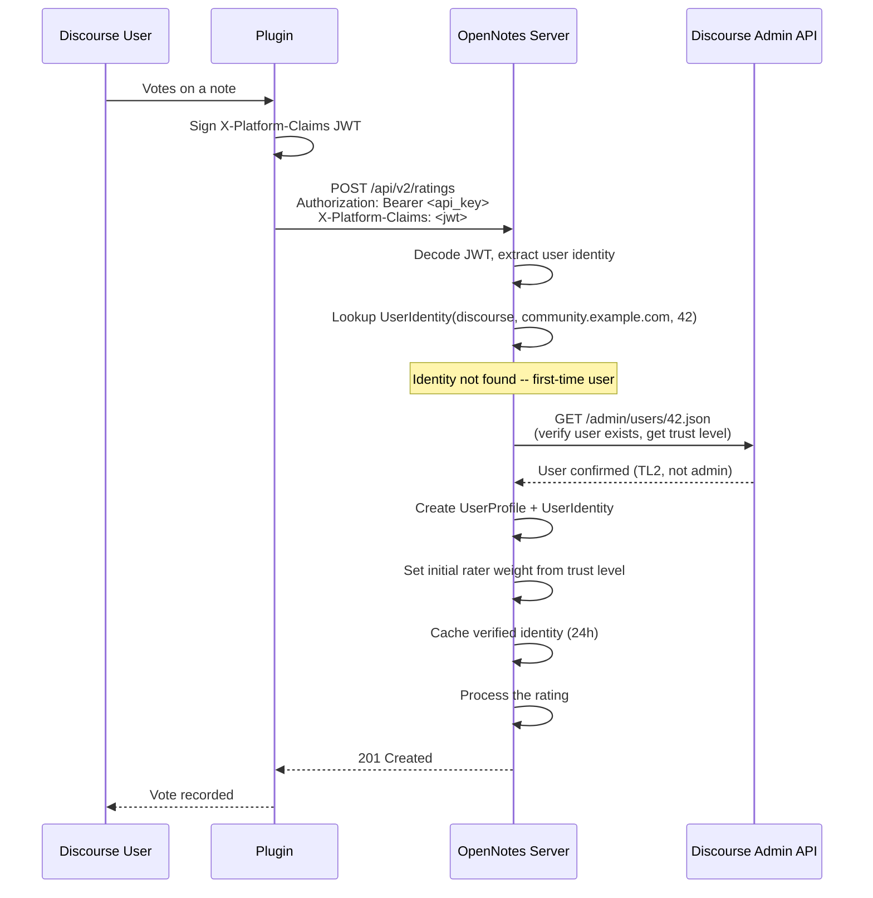
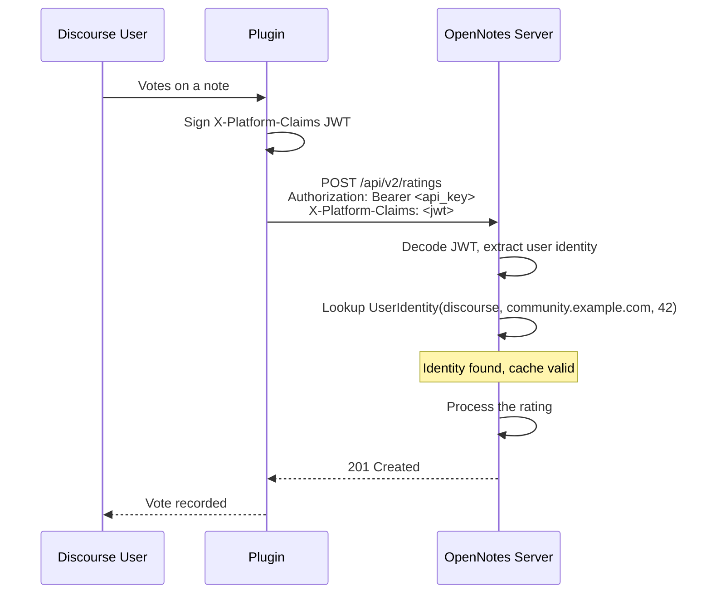
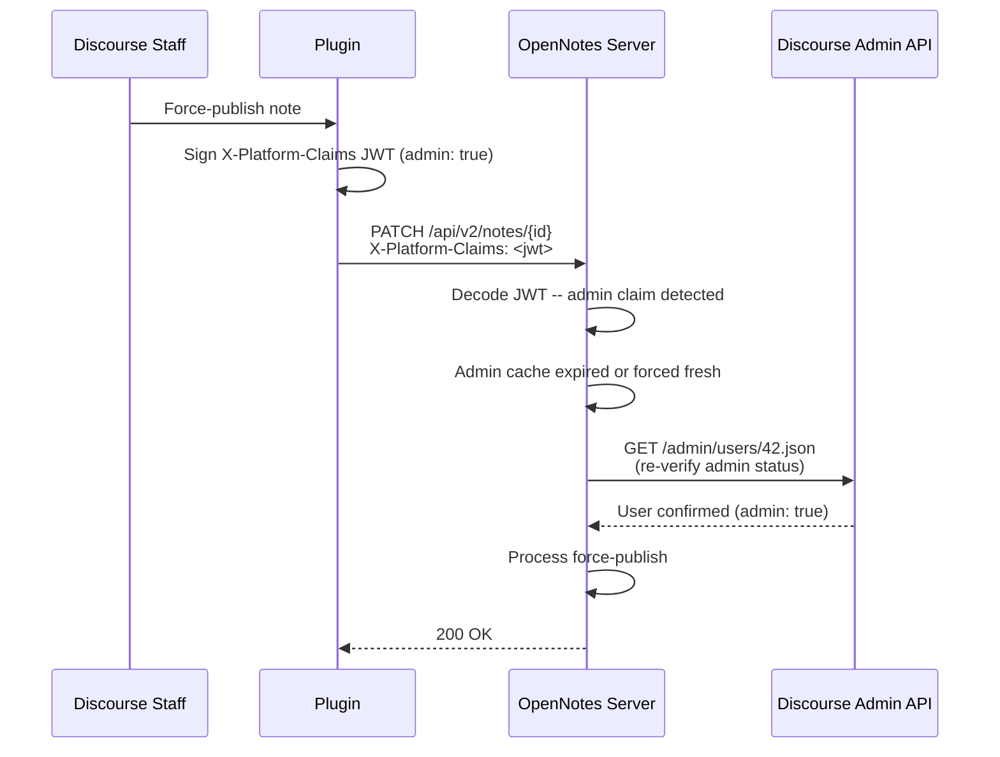
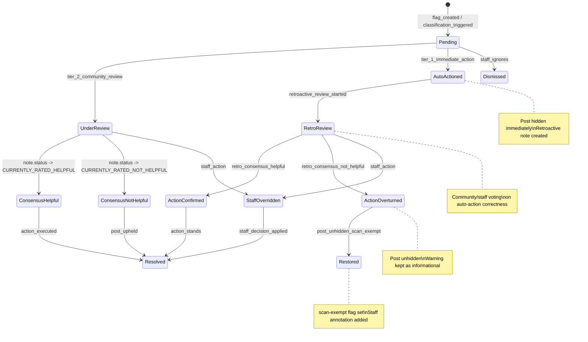
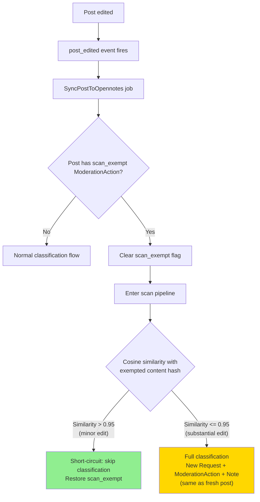

# OpenNotes for Discourse — MVP Product Specification

## 1. Executive Summary

A Discourse plugin that acts as a **thin client/adapter** between Discourse and the existing OpenNotes server (`opennotes-server`). The plugin handles Discourse-specific integration (event hooks, UI components, review queue) while delegating all classification, scoring, consensus computation, and data storage to the OpenNotes API.

**One-line pitch:** "Install one plugin, connect to OpenNotes, and let your community help moderate itself."

**Architecture principle:** The plugin contains no business logic for classification or scoring. It is an adapter that maps Discourse concepts (posts, flags, trust levels) to OpenNotes concepts (requests, notes, ratings, scoring) and renders the results back into Discourse's UI.

---

## 2. What the OpenNotes Server Already Provides

The plugin delegates to the existing `opennotes-server` (FastAPI, PostgreSQL, JSON:API). Key existing capabilities:

| Server Capability | API Surface | Maps To Plugin Need |
|---|---|---|
| **Notes** (CRUD, status tracking) | `POST/GET/PATCH/DELETE /api/v2/notes` | Community review items ("this post needs context") |
| **Ratings** (per-note votes with helpfulness levels) | `POST /api/v2/ratings`, `GET /api/v2/notes/{id}/ratings` | Community votes on whether a moderation action is justified |
| **Scoring** (adaptive tiers: Bayesian -> MF as data grows) | `POST /api/v2/scoring/score`, `GET /api/v2/scoring/notes/{id}/score` | Consensus computation with bridging algorithm |
| **Requests** (content flagged for review) | `POST/GET /api/v2/requests` | Flagged Discourse posts awaiting community notes |
| **AI note generation** | `POST /api/v2/requests/{id}/ai-notes` | Auto-generate context notes for flagged content |
| **Bulk content scan** (OpenAI moderation, flashpoint) | `POST /api/v1/bulk-content-scan/*` | AI classification of posts |
| **Community servers** (multi-tenant) | `GET /api/v2/community-servers/*` | Each Discourse instance = one community server |
| **Monitored channels** | `POST/GET /api/v2/monitored-channels` | Which Discourse categories to monitor |
| **Community config** (feature flags, thresholds) | `GET/PATCH /api/v1/community-config/*` | Admin-configurable settings |
| **LLM config** (per-community model settings) | `POST/GET /api/v1/community-servers/{id}/llm-config` | Custom AI provider config |
| **Outbound webhooks** | `POST /api/v1/webhooks/register` (extended) | Server -> Discourse notifications when consensus is reached |
| **User profiles** (with community membership) | `GET /api/v2/user-profiles/lookup` (extended) | Map Discourse users to OpenNotes profiles |
| **Scoring analysis & history** | `GET /api/v2/community-servers/{id}/scoring-analysis` | Admin dashboard data |
| **Auth** (JWT, API keys, service accounts) | `POST /api/v1/auth/*` | Plugin authenticates as service account |

**What does NOT need to be in the plugin:**
- Classification models or API calls (server has `bulk_content_scan` with OpenAI moderation + flashpoint)
- Bridging/consensus algorithm (server has `notes/scoring` with adaptive tiers)
- User reputation/scoring data (server has `user_profiles` + scoring snapshots)
- Data storage for votes, notes, or scores (all in server's PostgreSQL)

---

## 3. Plugin Architecture

### 3.1 Design Principle: Thin Adapter



### 3.2 Plugin Structure

```
discourse-opennotes/
  plugin.rb                          # Entry point, event hooks, settings
  config/
    settings.yml                     # Admin settings (server URL, API key, thresholds)
    locales/
      server.en.yml
      client.en.yml
  app/
    controllers/
      opennotes/
        webhook_controller.rb        # Receives webhooks from OpenNotes server
        community_reviews_controller.rb  # Proxies review data for non-staff UI
    models/
      reviewable_opennotes_item.rb   # Discourse Reviewable subclass (thin -- data lives on server)
    serializers/
      opennotes/
        review_serializer.rb         # Serializes server data for Discourse frontend
    jobs/
      regular/
        sync_post_to_opennotes.rb    # Push new/edited posts to server for classification
        sync_flag_to_opennotes.rb    # Push user flags as requests
      scheduled/
        sync_scoring_status.rb       # Periodic check for completed consensus (backup for webhooks)
  lib/
    opennotes/
      client.rb                      # HTTP client for OpenNotes JSON:API
      platform_claims.rb             # Sign/verify X-Platform-Claims JWT
      user_mapper.rb                 # Map Discourse users -> OpenNotes profiles (via server lookup)
      post_mapper.rb                 # Map Discourse posts -> OpenNotes requests/notes
      action_executor.rb             # Execute Discourse actions based on server consensus
  assets/
    javascripts/discourse/
      connectors/
        topic-above-post-stream/     # "Under community review" banner
        post-menu/                   # "Community context" button
      components/
        community-review-panel.gjs   # Review queue UI
        vote-widget.gjs              # Rating submission (calls server via plugin proxy)
        consensus-badge.gjs          # Shows resolved status
        opennotes-admin-dashboard.gjs
      routes/
        community-reviews.js
    stylesheets/
      opennotes.scss
  spec/
```

### 3.3 Key Discourse Extension Points

| Extension Point | Purpose |
|---|---|
| `DiscourseEvent.on(:post_created)` | Enqueue `SyncPostToOpennotes` job |
| `DiscourseEvent.on(:post_edited)` | Re-sync edited post |
| `DiscourseEvent.on(:flag_created)` | Create OpenNotes request for community review |
| Custom `Reviewable` subclass | Staff sees OpenNotes items in native `/review` queue |
| `add_to_serializer(:post, :opennotes_status)` | Inject review status badge data |
| `add_admin_route` | Admin panel for OpenNotes config + dashboard |
| Plugin outlets (Ember) | UI injection for banners, badges, review button |
| Webhook endpoint | Receive server callbacks on consensus/scoring events |

---

## 4. Data Flow

### 4.1 Post Classification (Two-Tier Action Model)

Posts are classified and routed through a **two-tier action model**:
- **Tier 1 (Immediate):** High-confidence classifications trigger immediate platform action (auto-hide) plus retroactive community review.
- **Tier 2 (Consensus):** Lower-confidence classifications enter the community review pipeline and wait for consensus before any action is taken.

The classification produces an OpenAI-moderation-like output: a map of **labels** (boolean flags, e.g., `harassment: true`) with optional **numerical scores** (e.g., `harassment_score: 0.92`). A per-category **moderation decision step** compares these against configured thresholds to determine the action tier.



#### Moderation Decision Contract

The classification output is a structured result:

```json
{
  "labels": {
    "harassment": true,
    "misinformation": false,
    "spam": true,
    "hate_speech": false
  },
  "scores": {
    "harassment": 0.92,
    "spam": 0.87
  }
}
```

- **Labels:** Boolean flags indicating detected categories. Not every label has a numerical score (some are purely boolean).
- **Scores:** Optional confidence values (0.0-1.0) for labels that support them.
- **Exact label set:** Determined in TASK-1401 (scan engine redesign). The spec defines the contract shape, not the specific labels.

Per-category configuration maps labels to action tiers:

| Setting | Example Value | Effect |
|---|---|---|
| `auto_action_labels` | `["harassment", "spam"]` | Labels that can trigger Tier 1 (immediate action) |
| `auto_action_min_score` | `0.90` | Minimum score for Tier 1 (labels without scores use boolean only) |
| `review_labels` | `["misinformation", "hate_speech"]` | Labels that trigger Tier 2 (consensus pipeline) |
| `review_min_score` | `0.50` | Minimum score for Tier 2 |
| `label_routing` | `{"staff": [...], "community": [...]}` | Per-label review group routing (see section 4.4) |

#### Tier 1: Immediate Action + Retroactive Review

When classification exceeds the auto-action threshold, the server creates three records atomically:

1. **Moderation action** — records that an action was taken, what type, and why
2. **Request** — the content review request (same as Tier 2)
3. **Retroactive note** — e.g., "This post was auto-hidden for harassment (confidence: 0.92). Was this action correct?"

The plugin then:
- Executes the Discourse action (hide post via `PostAction.act(post, :hide)`)
- Adds a Discourse staff message annotation to the post (visible to staff, not a separate post)
- Creates a `ReviewableOpennotesItem` in the "Auto-Actioned" state for retroactive review

#### Tier 2: Consensus Pipeline (Unchanged)

Same as the existing flow — request + AI-generated explanatory note enters the community review queue. No action until consensus is reached.

### 4.2 Community Review (Voting)



### 4.3 Retroactive Review (Tier 1 Posts)

When a Tier 1 auto-action is taken, the community (or staff, depending on review group) reviews whether the action was correct:



**Overturn mechanics:**
- **Partial reversal:** Post is unhidden, but the warning stays on the author's record as informational ("auto-flagged but overturned"). Helps track false-positive patterns without punishing the author.
- **Scan-exempt flag:** Restored posts get a `scan-exempt` flag that prevents re-scan ping-pong. Staff can remove the flag to allow re-scanning if needed.
- **Discourse staff annotation:** Uses Discourse's built-in staff message mechanism (not a separate post) to annotate "this post was hidden but came back after community review."

**Scoring:** Retroactive review votes participate in the same scoring pipeline as forward-looking consensus votes. Both reveal preferences about helpful vs unhelpful content — there is no need to carve out retroactive votes from scoring calibration.

**Source of truth:** Server owns review state ("overturn approved"). Discourse owns platform state (hidden/visible). Plugin translates server decisions into Discourse actions. No reconciliation for MVP.

### 4.4 Review Groups

Review groups control **who can review** each type of flagged content. They are scoped to **labels within a category** — different classification labels can be routed to different review groups in the same category.

| Review Group | Who Can Review | Example Labels |
|---|---|---|
| `community` | TL2+ | `misinformation`, `off_topic` |
| `trusted` | TL3+ | `self_harm`, `sensitive_content` |
| `staff` | Moderators and admins only | `harassment`, `hate_speech`, `csam` |

**Configuration model:** Per category, admins map labels to review groups:

```json
{
  "general-discussion": {
    "label_routing": {
      "staff": ["harassment", "hate_speech", "csam"],
      "trusted": ["self_harm"],
      "community": ["misinformation", "spam", "off_topic"]
    }
  }
}
```

**Defaults:**
- **Staff** sees all labels (implicit catch-all)
- **Community and trusted** see no labels unless explicitly configured
- This means by default, all flagged items go to staff-only review. Admins opt labels into community review.

**Behavior:** When a post is classified with multiple labels (e.g., `harassment` + `spam`), the **most restrictive** review group applies. If any label routes to `staff`, the item goes to staff-only review.

**Admin override:** Admins can route all labels to `community` to make everything available for everyone to review.

### 4.5 Concept Mapping

| Discourse Concept | OpenNotes Server Concept |
|---|---|
| Discourse instance | Community Server (`platform: "discourse"`) |
| Discourse category (monitored) | Monitored Channel |
| Discourse post (flagged) | Request |
| Community review note | Note |
| Community vote | Rating (with `helpfulness_level`) |
| Consensus result | Scoring snapshot (note status) |
| Discourse user | User Profile (mapped via platform identity with `provider_scope`) |
| Admin thresholds | Community Config |
| Discourse trust level | Profile metadata (seeds rater weight) |

---

## 5. User-Facing Features

### 5.1 Community Members (TL2+)

- `/community-reviews` page showing posts under review (fetched from server)
- Each item shows: post content, context, category, reason flagged
- **Vote widget:** maps to OpenNotes ratings -- "Helpful" / "Somewhat Helpful" / "Not Helpful" on existing notes (community-authored notes deferred to v2)
- Users don't see scores until consensus is reached
- After resolution: "Community Reviewed" badge on posts

### 5.2 Moderators

- OpenNotes items in native `/review` queue via `ReviewableOpennotesItem`
- Staff sees: AI classification scores, current rating tallies, individual notes with ratings, scoring analysis from server
- Staff can override: force-publish a note, or take direct Discourse action
- Staff can escalate: remove from community review, handle directly

### 5.3 Admins

**Settings** (stored as Discourse site settings, some synced to server as community config):

| Setting | Purpose | Stored |
|---|---|---|
| `opennotes_server_url` | URL of OpenNotes server | Discourse only |
| `opennotes_api_key` | Service account API key | Discourse only |
| `opennotes_enabled` | Master switch | Discourse only |
| `opennotes_monitored_categories` | Which categories to scan | Synced -> monitored channels |
| `opennotes_reviewer_min_trust_level` | Who can participate | Discourse only (enforced in plugin) |
| `opennotes_route_flags_to_community` | Flags -> community review | Discourse only |
| `opennotes_staff_approval_required` | Require staff approval | Community config |
| `opennotes_auto_hide_on_consensus` | Auto-hide when note rated helpful | Community config |

**Per-Category Settings** (configured per monitored category, synced to server as monitored channel config):

| Setting | Purpose | Default |
|---|---|---|
| `auto_action_labels` | Labels that trigger Tier 1 immediate action | `[]` (disabled) |
| `auto_action_min_score` | Minimum score for Tier 1 auto-action | `0.90` |
| `review_labels` | Labels that trigger Tier 2 consensus pipeline | All labels |
| `review_min_score` | Minimum score for Tier 2 review | `0.50` |
| `label_routing` | Per-label review group mapping (see section 4.4) | `{"staff": ["*"]}` (staff sees all) |

**Dashboard** (renders data from server's scoring analysis endpoint):
- Activity metrics, classification breakdown, consensus health, top reviewers, false positive rate
- All data fetched from `GET /api/v2/community-servers/{id}/scoring-analysis` and `/scoring-history`

---

## 6. What the Plugin Does NOT Do

The plugin explicitly does NOT:

- Store notes, ratings, or scores (all on server)
- Run any classification model or call Perspective/OpenAI directly (server handles via bulk_content_scan)
- Implement the bridging/consensus algorithm (server's adaptive scoring tiers handle this)
- Manage user reputation weights (server's scoring system handles rater weights)
- Store webhook configuration (server manages)
- Maintain a local identity mapping table (server owns identity via `provider_scope`)

The plugin's job is: **listen to Discourse events -> call server API -> render results in Discourse UI -> execute Discourse actions based on server decisions.**

---

## 7. Identity Mapping

### 7.1 Design Principles

- **Discourse acts as identity provider.** Each Discourse user maps to an OpenNotes profile via the server's identity system.
- **Plugin runs in untrusted environments.** Unlike the Discord bot (which we operate), the Discourse plugin runs in customer-managed Discourse instances. The server must verify identity claims.
- **No local identity table.** Following the thin-adapter principle, the plugin does not maintain a local `discourse_user_id -> opennotes_profile_id` table. Identity resolution happens via the server's profile lookup endpoint.

### 7.2 Identity Model: `provider_scope`

The server's `UserIdentity` table gains a new `provider_scope` column to handle site-scoped platforms:

| Field | Discord | Discourse |
|---|---|---|
| `provider` | `"discord"` | `"discourse"` |
| `provider_scope` | `null` (globally unique snowflake IDs) | Instance URL, e.g. `"community.example.com"` |
| `provider_user_id` | `"123456789"` | `"42"` |

**Uniqueness constraint:** `(provider, provider_scope, provider_user_id)`

This ensures user 42 on `community-a.example.com` is a different identity than user 42 on `community-b.example.com`.

### 7.3 Authentication Headers

The plugin uses two authentication layers:

1. **Service account API key** in `Authorization: Bearer <api_key>` header -- authenticates the plugin as a trusted service.
2. **Platform claims JWT** in `X-Platform-Claims` header -- asserts the identity of the Discourse user on whose behalf the action is taken. Contains:

```json
{
  "platform": "discourse",
  "scope": "community.example.com",
  "sub": "42",
  "username": "alice",
  "trust_level": 2,
  "admin": false,
  "moderator": false,
  "iat": 1711500000,
  "exp": 1711503600
}
```

The JWT is signed with a shared secret provisioned during community server registration.

### 7.4 Verification Flows

#### First-Time User (Slow Path)

When a Discourse user first interacts with OpenNotes (votes, writes a note), the server has no profile for them.



#### Returning User (Fast Path)



#### Admin/Moderator Action (Elevated Verification)

For sensitive operations (staff override, force-publish, community config changes), the server uses a shorter cache TTL or forces fresh verification:



### 7.5 Trust Level as Rater Weight Seed

Discourse trust levels are stored as profile metadata and used to **seed initial rater weights** for cold-start:

| Trust Level | Initial Weight | Rationale |
|---|---|---|
| TL0 (New User) | Cannot vote (gated by plugin) | Too new to participate |
| TL1 (Basic) | Cannot vote (gated by plugin) | Too new to participate |
| TL2 (Member) | 1.0 (baseline) | Standard community member |
| TL3 (Regular) | 1.2 | Proven track record |
| TL4 (Leader) | 1.5 | Community leader |

Weights converge to behavior-based over time as the scoring system accumulates rating history. The seed weight only affects a rater's first few votes.

---

## 8. Bootstrap and Provisioning

### 8.1 Plugin Setup Flow

When an admin installs the plugin and configures it:

1. Admin enters OpenNotes server URL and API key in Discourse admin settings.
2. Plugin calls `POST /api/v2/community-servers` to register the Discourse instance:
   ```json
   {
     "platform": "discourse",
     "platform_community_server_id": "community.example.com",
     "name": "Community Forum"
   }
   ```
3. Server creates a `CommunityServer` record. **Discourse communities must be pre-registered** -- the server does not auto-create communities from untrusted platforms on first contact.
4. Plugin registers its webhook callback URL (extends existing endpoint):
   ```
   POST /api/v1/webhooks/register
   {
     "url": "https://community.example.com/opennotes/webhooks/receive",
     "secret": "<generated-hmac-secret>",
     "platform_community_server_id": "community.example.com",
     "channel_id": null
   }
   ```
   > **Current state:** This endpoint exists but is unauthenticated and has no `events` filter. TASK-1400.06 will add `Authorization` requirement and event filtering.
5. Plugin syncs monitored categories to server as monitored channels:
   ```
   POST /api/v2/monitored-channels
   {
     "community_server_id": "<uuid>",
     "platform_channel_id": "general-discussion",
     "name": "General Discussion"
   }
   ```

### 8.2 Category Sync

When admin changes `opennotes_monitored_categories`:
- Plugin compares current Discourse categories with server's monitored channels
- Adds new categories, removes deactivated ones
- **Discourse is authoritative** for which categories are monitored; server stores the mapping

### 8.3 Settings Sync

Some Discourse site settings are synced to the server's community config:
- `opennotes_staff_approval_required` -> `community_config.staff_approval_required`
- `opennotes_auto_hide_on_consensus` -> `community_config.auto_hide_on_consensus`

**Discourse is authoritative.** Changes flow one-way: Discourse -> server. The plugin syncs on setting change via `DiscourseEvent.on(:site_setting_changed)`.

---

## 9. Reviewable State Machine

### 9.1 Overview

The plugin implements `ReviewableOpennotesItem`, a subclass of Discourse's `Reviewable` model. This puts OpenNotes items into Discourse's native `/review` queue for staff visibility.

**Key principle:** The Reviewable is a thin view over server-side state. The plugin does not store moderation state locally -- it queries the server and maps the response to Discourse's Reviewable actions.

### 9.2 State Machine

The state machine supports both **forward-looking** (Tier 2 consensus) and **retroactive** (Tier 1 auto-action review) flows, with reversible transitions for overturn.



### 9.3 NoteStatus to Discourse Action Mapping

| Server NoteStatus | Reviewable State | Discourse Action | API Call |
|---|---|---|---|
| `NEEDS_MORE_RATINGS` | Under Review | No action -- show "Under Review" banner | None |
| `CURRENTLY_RATED_HELPFUL` | Consensus: Helpful | Hide post (if `auto_hide_on_consensus`), warn author, show "Community Reviewed" badge | `PostAction.act(post, :hide)` |
| `CURRENTLY_RATED_NOT_HELPFUL` | Consensus: Not Helpful | Uphold post, show "Reviewed -- No Action" badge | Update Reviewable status |

### 9.4 Staff Actions

| Action | Discourse UI | Server API Call | Effect |
|---|---|---|---|
| **Reject (hide post)** | "Agree" button in /review | `POST /api/v2/notes/{id}/force-publish` | Force note to CURRENTLY_RATED_HELPFUL, triggers hide post |
| **Approve (uphold post)** | "Disagree" button in /review | *New endpoint needed:* `POST /api/v2/notes/{id}/dismiss` | Force note to CURRENTLY_RATED_NOT_HELPFUL, uphold post |
| **Ignore (dismiss)** | "Ignore" button in /review | `DELETE /api/v2/requests/{id}` | Remove from review queue |
| **Escalate** | "Escalate" in plugin UI | `PATCH /api/v2/requests/{id}` with `escalated: true` | Remove from community review, handle directly |

> **Note:** The server currently only has `POST /api/v2/notes/{id}/force-publish` (sets CURRENTLY_RATED_HELPFUL). A `dismiss` endpoint for the opposite direction needs to be added as part of TASK-1400.05 or TASK-1400.06.

### 9.5 Webhook-Triggered Transitions

When the server reaches consensus (via community voting or scoring), it sends a webhook to the plugin. The plugin's `webhook_controller` receives the event and:

1. Looks up the associated Discourse post via the request's metadata
2. Updates the `ReviewableOpennotesItem` status
3. Executes the recommended Discourse action (if `auto_hide_on_consensus` is enabled)
4. Updates the post's serializer data (badge, banner)

**Idempotency:** The plugin checks the current Reviewable state before acting. Duplicate webhook deliveries are safe because the plugin verifies state compatibility before applying transitions. The state machine supports backward transitions (overturn) but only via explicit retroactive review consensus — never from duplicate deliveries.

---

## 10. Outbound Webhook Strategy

### 10.1 Registration

During plugin setup (section 8), the plugin registers a webhook callback URL with the server. The server stores the webhook configuration and begins delivering events.

### 10.2 Event Types

The server sends minimal payloads. The plugin fetches full details from the API on receipt.

**`note.status_changed`**
```json
{
  "event": "note.status_changed",
  "note_id": "uuid",
  "status": "CURRENTLY_RATED_HELPFUL",
  "request_id": "uuid",
  "recommended_action": "hide_post",
  "community_server_id": "uuid",
  "timestamp": "2026-03-27T12:00:00Z"
}
```

**`request.classified`**
```json
{
  "event": "request.classified",
  "request_id": "uuid",
  "classification_score": 0.85,
  "recommended_action": "community_review",
  "community_server_id": "uuid",
  "timestamp": "2026-03-27T12:00:00Z"
}
```

**`scoring.completed`**
```json
{
  "event": "scoring.completed",
  "community_server_id": "uuid",
  "notes_scored": 12,
  "summary": {"helpful": 5, "not_helpful": 3, "needs_more": 4},
  "timestamp": "2026-03-27T12:00:00Z"
}
```

### 10.3 Delivery and Signing

- **HMAC-SHA256 signature** in `X-Webhook-Signature` header: `sha256=<hex-digest>`
- The plugin verifies the signature using the shared secret from registration before processing.
- **Delivery timeout:** 5 seconds per attempt.
- **Retry policy:** 3 attempts with exponential backoff (10s, 30s, 90s). After exhaustion, event is dead-lettered.
- **Ordering:** Events are delivered in order per community server. If delivery fails, subsequent events for that community are held until the backlog clears or is dead-lettered.

### 10.4 Polling Fallback

The plugin's `sync_scoring_status` Sidekiq scheduled job acts as a backup for missed webhooks:

- **Interval:** Every 5 minutes.
- **Query:** `GET /api/v2/requests?filter[status]=COMPLETED&filter[requested_at__gte]=<last_poll_timestamp>&filter[community_server_id]=<id>`
- **Reconciliation:** For each resolved request, the plugin checks if the corresponding `ReviewableOpennotesItem` has already been updated. If not, it applies the action.
- **Idempotency:** The plugin stores `last_poll_timestamp` and each request's `updated_at` to avoid reprocessing.

### 10.5 Failure Modes

| Scenario | Behavior |
|---|---|
| **Server down** | Plugin defers classification. Posts publish normally. Classification + review happens when server recovers. Sidekiq jobs retry with backoff. |
| **Plugin down** | Webhooks dead-letter after 3 retries. Polling catches up when Discourse restarts. No data loss (server is source of truth). |
| **Network partition** | Same as server-down. Polling reconciles after reconnection. |
| **Duplicate webhook delivery** | Safe -- plugin checks Reviewable state before acting. Forward-only transitions prevent double actions. |
| **Stale polling results** | Plugin compares `updated_at` timestamps. If the local Reviewable was already updated (by webhook), the poll result is a no-op. |

---

## 11. API Contract

### 11.1 Authentication

All plugin requests to the server use two headers:

| Header | Purpose | Example |
|---|---|---|
| `Authorization` | Service account API key | `Bearer sk_live_abc123...` |
| `X-Platform-Claims` | Signed JWT with Discourse user identity | `eyJhbGciOiJIUzI1NiJ9...` |
| `X-Platform-Type` | Routing hint (redundant with JWT but useful for middleware) | `discourse` |

The `Authorization` header authenticates the plugin as a trusted service. The `X-Platform-Claims` header identifies which Discourse user the action is on behalf of.

**Security:** The server's `InternalHeaderValidationMiddleware` must be extended to protect `X-Platform-*` headers (strip from untrusted sources, same as `X-Discord-*`).

### 11.2 Existing Endpoints Used by Plugin

| Endpoint | Method | Purpose | Plugin Use |
|---|---|---|---|
| `/api/v2/requests` | POST | Create content review request | When post flagged or classified |
| `/api/v2/requests` | GET | List pending requests | Community review queue |
| `/api/v2/notes` | POST | Create a community note | User submits context note |
| `/api/v2/notes/{id}` | PATCH | Update note status | Staff force-publish |
| `/api/v2/ratings` | POST | Submit a rating | User votes on note |
| `/api/v2/notes/{id}/ratings` | GET | Get ratings for note | Display vote tallies |
| `/api/v2/scoring/score` | POST | Trigger scoring | Not called by plugin -- rating creation auto-dispatches rescoring server-side |
| `/api/v2/user-profiles/lookup` | GET | Resolve platform user to profile | Every authenticated request |
| `/api/v2/community-servers` | POST | Register Discourse instance | Plugin setup |
| `/api/v2/monitored-channels` | POST/DELETE | Sync monitored categories | Settings change |
| `/api/v1/community-config/{id}` | PATCH | Sync admin settings | Settings change |
| `/api/v2/requests/{id}/ai-notes` | POST | Generate AI note | After classification |
| `/api/v1/webhooks/register` | POST | Register webhook callback | Plugin setup |

### 11.3 Endpoints Requiring Extension

These existing endpoints need modification for Discourse support:

**`GET /api/v2/user-profiles/lookup`**
- Currently rejects non-discord platforms (hardcoded check at `profiles_jsonapi_router.py:990`)
- **Extension:** Accept `platform=discourse`, add `provider_scope` query parameter
- **New behavior:** When `platform=discourse`, use `provider_scope` to disambiguate multi-instance users

**`POST /api/v1/webhooks/register`**
- Currently unauthenticated, accepts `url`, `secret`, `platform_community_server_id`, `channel_id`
- **Extension:** Require `Authorization` header (service account API key). Add `events` field to specify which event types to receive. Add Discourse instance identity canonicalization.

**`POST /api/v2/community-servers`**
- Currently auto-creates communities for Discord
- **Extension:** For `platform=discourse`, require explicit registration (no auto-create from first contact). Validate that the Discourse instance URL is reachable.

### 11.4 New Server-Side Components

| Component | Purpose | Task |
|---|---|---|
| `DISCOURSE` in `AuthProvider` enum | Identity provider for Discourse users | TASK-1400.07 |
| `provider_scope` column on `UserIdentity` | Multi-instance user disambiguation | TASK-1400.07 |
| `PlatformContextMiddleware` | Generic `X-Platform-*` header handling | TASK-1400.07 |
| `X-Platform-*` header protection | Prevent spoofing (same as `X-Discord-*`) | TASK-1400.07 |
| Outbound webhook delivery system | Server -> plugin event notifications | TASK-1400.06 |
| `DiscourseVerifier` | Verify user identity against Discourse API | TASK-1400.07 |
| Generic `can_administer_community` capability | Replace Discord-specific `has_manage_server` | TASK-1400.07 |
| `ModerationAction` model + CRUD | First-class moderation action records (section 13) | TASK-1400.09 |
| `PATCH /api/v2/moderation-actions/{id}` | Plugin confirms action execution/overturn | TASK-1400.09 |
| `GET /api/v2/moderation-actions/{id}` | Plugin fetches action details after webhook | TASK-1400.09 |
| `moderation_action.*` events | 6 new outbound event types for action lifecycle | TASK-1400.09 |

### 11.5 Error Handling Contract

| HTTP Status | Meaning | Plugin Behavior |
|---|---|---|
| 200/201 | Success | Process response |
| 400 | Bad request (malformed payload) | Log error, do not retry |
| 401 | Invalid API key | Alert admin, disable plugin |
| 403 | Insufficient permissions | Log, show user-facing error |
| 404 | Resource not found | Handle gracefully (e.g., user not yet registered) |
| 409 | Conflict (duplicate) | Idempotent -- treat as success |
| 422 | Validation error | Log error with details, do not retry |
| 429 | Rate limited | Retry with `Retry-After` header value |
| 500/502/503 | Server error | Retry with exponential backoff (Sidekiq) |

---

## 12. MVP Scope

### In v1

| Feature | How |
|---|---|
| Post scanning on create/edit | Sidekiq job -> server's request + classification endpoints |
| Two-tier action model | Tier 1: immediate action on high-confidence, Tier 2: consensus pipeline |
| Retroactive review | Auto-actioned posts reviewed by community/staff, can be overturned |
| Review groups | Per-category config: community (TL2+), trusted (TL3+), or staff-only |
| Flag routing to community review | Flag event -> server request |
| Community review queue UI | Ember route fetching from server via plugin proxy |
| Voting (ratings) | Plugin proxies to server's ratings endpoint |
| Consensus -> action | Webhook from server triggers Discourse hide/warn/silence |
| Staff override | Via Discourse Reviewable actions, synced to server (force-publish) |
| Admin settings | Discourse site settings with per-category thresholds, synced to server |
| Admin dashboard | Renders server's scoring-analysis data |
| Identity mapping | Hybrid verification with provider_scope |
| Outbound webhooks | Minimal payloads with HMAC-SHA256, polling fallback |
| Bootstrap/provisioning | Community server registration, category sync, webhook setup |

### Deferred to v2+

| Feature | Why |
|---|---|
| Writing community notes (not just voting) | v1 uses AI-generated notes; community-authored notes add UX complexity |
| Configuration assistant agent | Vibecheck-like agent that sets reasonable thresholds based on initial scan results of the server |
| Replace mode for flags | Too risky until system proves accuracy |
| Anonymous voting | Deferred UX decision |
| Real-time updates via MessageBus | v1 uses polling; v2 could use server webhooks -> MessageBus push |
| WordPress/other platform plugins | Same server, different adapter -- after Discourse proves the model |
| JWKS-based asymmetric key verification | v1 uses shared-secret JWT; v2 could use JWKS per community for stronger key management |
| PlatformVerifier registry pattern | v1 uses simple verify-on-first-write; v2 could formalize as pluggable verifier interface |

### Technical Constraints

- **Network dependency:** Plugin requires connectivity to OpenNotes server. If server is down, classification is deferred (posts still publish, reviewed later).
- **Latency:** Classification is async (Sidekiq job). Community review is inherently async (hours/days). No real-time blocking.
- **Server provisioning:** Discourse admins use OpenNotes-hosted server for MVP (reduces friction). Self-hosted option for enterprise later.
- **Untrusted environment:** Plugin runs in customer Discourse instances. Server verifies all identity claims. No auto-creation of communities from untrusted sources.

---

## 13. Moderation Action Contract

### 13.1 Overview

The two-tier action model (section 4.1) requires a server-side record for tracking moderation actions taken on posts. The `ModerationAction` model is a first-class record — semantically similar to `MessageArchive` in the existing codebase: it represents a log of an event that the request/note/rating loop operates on.

**Relationship to existing models:**

```
ModerationAction (the action taken)
  ├── Request (the content review request)
  │     └── Note (retroactive/explanatory note for community voting)
  │           └── Ratings (community votes)
  └── classifier_evidence (JSONB: labels, scores, threshold, config snapshot)
```

The Note remains a note. The ModerationAction is a separate record that *references* a Note and Request. This keeps the scoring pipeline clean — notes and ratings work the same regardless of whether they're attached to a Tier 1 auto-action or a Tier 2 consensus review.

### 13.2 ModerationAction Schema

```python
class ModerationAction(Base, TimestampMixin):
    __tablename__ = "moderation_actions"

    id: UUID                          # UUIDv7 primary key
    request_id: UUID                  # FK to Request
    note_id: UUID | None              # FK to Note (retroactive/explanatory note)
    community_server_id: UUID         # FK to CommunityServer

    # Action details
    action_type: str                  # "hide", "unhide", "warn", "silence", "delete"
    action_tier: str                  # "tier_1_immediate" or "tier_2_consensus"
    action_state: str                 # State machine state (see 13.3)
    platform_action_id: str | None    # Platform-specific action ID (Discourse PostAction ID)

    # Classification evidence (JSONB)
    classifier_evidence: dict         # {labels: {}, scores: {}, threshold: float,
                                      #  model_version: str, category_config_snapshot: {}}

    # Review metadata
    review_group: str                 # "community", "trusted", or "staff"
    scan_exempt: bool                 # Whether post is exempt from re-scanning
    scan_exempt_content_hash: str | None  # Hash of content at exemption time (PreviouslySeen)

    # Overturn tracking
    overturned_at: datetime | None
    overturned_reason: str | None     # "community_consensus" or "staff_override"

    # Timestamps
    proposed_at: datetime
    applied_at: datetime | None
    confirmed_at: datetime | None

    created_at: datetime
    updated_at: datetime
```

### 13.3 Action State Machine

```mermaid
stateDiagram-v2
    [*] --> Proposed: classification_triggers_action

    %% Tier 1: Immediate action path
    Proposed --> Applied: plugin_executes_action
    Applied --> RetroReview: retroactive_review_started
    RetroReview --> Confirmed: retro_consensus_helpful
    RetroReview --> Overturned: retro_consensus_not_helpful
    Overturned --> ScanExempt: post_restored_exempt

    %% Tier 2: Consensus path (action proposed but not applied until consensus)
    Proposed --> UnderReview: tier_2_enters_consensus
    UnderReview --> Applied: consensus_helpful_action_approved
    UnderReview --> Dismissed: consensus_not_helpful_no_action

    %% Staff overrides (from any active state)
    Proposed --> Dismissed: staff_dismisses
    Applied --> Overturned: staff_overturns
    UnderReview --> Dismissed: staff_dismisses
    UnderReview --> Applied: staff_force_applies
    RetroReview --> Confirmed: staff_confirms
    RetroReview --> Overturned: staff_overturns

    %% Rescan after edit
    ScanExempt --> Proposed: edit_clears_exempt_rescan_triggers

    note right of Proposed: Server: action decided,\nwaiting for plugin to execute
    note right of Applied: Plugin: action executed on Discourse\n(post hidden, user warned, etc.)
    note right of RetroReview: Community/staff voting on\nwhether action was correct
    note right of Overturned: Action reversed.\nPost restored, warning kept as informational
    note right of ScanExempt: Post exempt from re-scan.\nContent hash stored for similarity check.
```

**Key states:**

| State | Meaning | Who transitions |
|---|---|---|
| `proposed` | Classification decided an action should be taken | Server (automatic) |
| `applied` | Plugin executed the Discourse action (hide/warn/etc.) | Plugin (confirms execution) |
| `retro_review` | Retroactive note is being voted on | Server (when review starts) |
| `confirmed` | Community/staff confirmed the action was correct | Server (consensus) |
| `overturned` | Community/staff determined the action was wrong | Server (consensus) |
| `scan_exempt` | Post restored and exempt from re-scanning | Server (after overturn) |
| `under_review` | Tier 2 only — awaiting consensus before any action | Server (classification) |
| `dismissed` | No action needed (consensus or staff dismiss) | Server (consensus or staff) |

### 13.4 Classifier Evidence Schema

The `classifier_evidence` JSONB field stores the full decision context:

```json
{
  "labels": {
    "harassment": true,
    "spam": true,
    "misinformation": false
  },
  "scores": {
    "harassment": 0.92,
    "spam": 0.87
  },
  "threshold_used": 0.90,
  "category_config_snapshot": {
    "auto_action_labels": ["harassment", "spam"],
    "auto_action_min_score": 0.90,
    "review_group": "staff",
    "label_routing": {"staff": ["harassment"], "community": ["spam"]}
  },
  "model_version": "scan-agent-v1.0",
  "scan_type": "post_created",
  "classification_timestamp": "2026-03-28T12:00:00Z"
}
```

This enables:
- **Audit:** "Why was this post hidden?" → full classifier output + threshold + config at time of decision
- **False positive analysis:** Query actions where `overturned = true` to identify systematic classifier errors
- **Threshold tuning:** Compare scores against thresholds across overturned vs confirmed actions

### 13.5 Plugin-Server Action Contract

#### Tier 1: Immediate Action Flow

| Step | Direction | API Call | Payload |
|---|---|---|---|
| 1. Classification triggers action | Server internal | — | ModerationAction created with state `proposed` |
| 2. Server notifies plugin | Server → Plugin | Webhook: `moderation_action.proposed` | `{action_id, request_id, action_type, recommended_action, classifier_evidence}` |
| 3. Plugin executes Discourse action | Plugin → Discourse | `PostAction.act(post, :hide)` | — |
| 4. Plugin confirms execution | Plugin → Server | `PATCH /api/v2/moderation-actions/{id}` | `{action_state: "applied", platform_action_id: "..."}` |
| 5. Retroactive review starts | Server internal | — | ModerationAction transitions to `retro_review` |
| 6. Community votes | Plugin → Server | `POST /api/v2/ratings` | Same as consensus flow |
| 7. Consensus reached | Server → Plugin | Webhook: `moderation_action.confirmed` or `moderation_action.overturned` | `{action_id, outcome, note_status}` |
| 8a. If confirmed | Plugin → Discourse | No action (post stays hidden) | — |
| 8b. If overturned | Plugin → Discourse | Unhide post, add staff annotation | `Post.unhide`, staff message |
| 9. Plugin confirms overturn | Plugin → Server | `PATCH /api/v2/moderation-actions/{id}` | `{action_state: "scan_exempt", scan_exempt_content_hash: "..."}` |

#### Tier 2: Consensus Flow

| Step | Direction | API Call |
|---|---|---|
| 1. Classification below auto-action threshold | Server internal | ModerationAction created with state `proposed`, then `under_review` |
| 2. Community reviews note | Same as existing consensus flow | Standard rating/scoring pipeline |
| 3. Consensus: helpful (action needed) | Server → Plugin | Webhook: `moderation_action.proposed` (with `action_tier: "tier_2_consensus"`) |
| 4. Plugin executes action | Plugin → Discourse | `PostAction.act(post, :hide)` |
| 5. Plugin confirms execution | Plugin → Server | `PATCH /api/v2/moderation-actions/{id}` with `{action_state: "applied"}` |
| 6. Consensus: not helpful (no action) | Server → Plugin | Webhook: `moderation_action.dismissed` |

### 13.6 Edit/Rescan Lifecycle



**Key rules:**
- **Edit always enters the scan pipeline.** The decision to skip happens *inside* the pipeline, not before it.
- **Scan-exempt content hash** is stored on the ModerationAction (similar to `PreviouslySeen` pattern). Cosine similarity check against the stored hash determines if the edit is minor.
- **Minor edit threshold:** 0.95 cosine similarity = trivially similar, short-circuit. Below 0.95 = substantial change, full re-classification.
- **Staff can remove scan-exempt** flag manually at any time to force re-scan regardless of similarity.

### 13.7 Outbound Events for Moderation Actions

New event types added to the `EventType` enum:

| Event | When | Payload |
|---|---|---|
| `moderation_action.proposed` | Classification decides an action should be taken | `{action_id, request_id, action_type, classifier_evidence, review_group}` |
| `moderation_action.applied` | Plugin confirms it executed the action on the platform | `{action_id, platform_action_id, applied_at}` |
| `moderation_action.retro_review_started` | Retroactive review note is open for voting | `{action_id, note_id, review_group}` |
| `moderation_action.confirmed` | Community/staff confirmed the action was correct | `{action_id, note_id, note_status}` |
| `moderation_action.overturned` | Community/staff overturned the action | `{action_id, note_id, note_status, scan_exempt: true}` |
| `moderation_action.dismissed` | No action needed (Tier 2 consensus or staff dismiss) | `{action_id, request_id, reason}` |

These events are delivered via the same outbound webhook mechanism (section 10): HMAC-SHA256 signed, 3 retries with exponential backoff, 5min polling fallback.

---

## Appendix A: Resolved Open Questions

These questions were originally in section 9 of the Obsidian spec. Each has been resolved with a concrete decision and integrated into the relevant spec section.

| # | Original Question | Decision | Spec Section |
|---|---|---|---|
| 1 | **Hosted vs. self-hosted server?** | OpenNotes-hosted for MVP. Self-hosted option for enterprise later. | Section 12 (Technical Constraints) |
| 2 | **How does the server's scoring tier system map to community size?** | Plugin presents results as-is. It doesn't need to know which algorithm (Bayesian vs MF) is running -- the server handles adaptive tier selection based on data volume. | Section 2 (Server Capabilities) |
| 3 | **Should the plugin expose full note-writing UX, or just voting?** | Voting only for v1. AI-generated notes provide context. Community-authored notes are v2 (adds UX complexity). | Section 12 (Deferred to v2+) |
| 4 | **Webhook reliability and polling interval?** | Outbound webhooks with HMAC-SHA256, 3 retries with exponential backoff (10s/30s/90s). Polling fallback every 5 minutes with idempotent reconciliation. | Section 10 (Outbound Webhook Strategy) |
| 5 | **How to handle Discourse trust levels on the server side?** | Trust level seeds initial rater weight (TL4=1.5, TL3=1.2, TL2=1.0 baseline). Weight converges to behavior-based over time. TL0/TL1 gated from voting by plugin. | Section 7.5 (Trust Level as Rater Weight Seed) |
