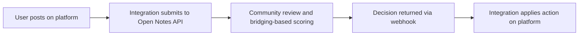

Open Notes is a moderation platform that combines AI classification with
community review. Integrations wire Open Notes into your platform so that
flagged content enters a bridging-based review loop, and consensus decisions
flow back as moderation actions.

## Who this is for

Pick the path that matches what you are doing right now.

- **Building a new integration?** Start with the [Integration Guide](/integration-guide/overview).
  It walks through onboarding, concepts (auth, scopes, headers), and an
  end-to-end content lifecycle. This is the primary path — most readers
  arrive here.
- **Running the Discourse plugin?** Jump straight to
  [Existing Integrations → Discourse](/existing-integrations/discourse/overview)
  for install, configure, upgrade, and troubleshoot guides.
- **Already have a `platform:adapter` API key?** Skip to the
  [API Reference](/api-reference/overview) for the full endpoint catalog.

## How it all fits together

- **`opennotes-server`** is the hosted REST API and scoring engine. It runs at
  `https://api.opennotes.ai` today.
- **`platform:adapter`-scoped API keys** are the public API boundary. You mint
  them on [platform.opennotes.ai](https://platform.opennotes.ai) after
  registering your community.
- **Integrations** (like the Discourse plugin) translate between your
  platform's content model and the Open Notes REST API. They use `X-Adapter-*`
  headers to carry end-user identity.
- The **Integration Guide** documents the public API contract. The **Discourse
  plugin** is the reference implementation — see the
  [Integration Guide overview](/integration-guide/overview) for the canonical
  statement on how the plugin serves as the tie-breaker for ambiguity.

| Section | Covers |
|---|---|
| Integration Guide | Onboarding via platform.opennotes.ai, auth, scopes, `X-Adapter-*` headers, endpoint walkthrough, webhooks, errors |
| Existing Integrations | Per-integration docs (install, configure, upgrade, troubleshoot). Discourse today. |
| API Reference | Exhaustive endpoint reference generated from the `/api/public/v1` OpenAPI schema |

## Something missing?

This site is published at [docs.opennotes.ai](https://docs.opennotes.ai). The
docs source lives at `opennotes-docs/` in the
[opennotes monorepo](https://github.com/opennotes-ai/opennotes). Open a PR or
file an issue — these pages are intentionally co-located with the code they
document.
