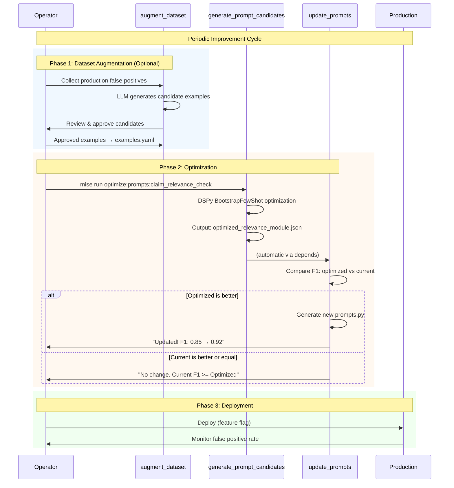

# Claim Relevance Check Prompt Optimization Workflow

This document describes the workflow for periodically improving the claim relevance check prompts using DSPy optimization.

## Overview

The prompt optimization system uses DSPy to automatically generate and evaluate improved prompts for determining whether a fact-check is relevant to a user's message. The workflow consists of three main components:

1. **Dataset Management** - Training examples in `examples.yaml`
2. **Prompt Generation** - DSPy optimization to generate candidates
3. **Evaluation & Update** - Compare against current prompts and update if better

## Workflow Diagram



## Mise Tasks

| Task | Description | When to Use |
|------|-------------|-------------|
| `optimize:prompts:claim_relevance_check` | Full workflow (generate → update) | Normal optimization run |
| `optimize:prompts:claim_relevance_check:generate_prompt_candidates` | Generate candidates only | Preview optimization without updating |
| `optimize:prompts:claim_relevance_check:update_prompts` | Compare and update only | Re-evaluate existing candidates |
| `optimize:prompts:claim_relevance_check:augment_dataset` | Add training examples | Grow the dataset |

## Quick Start

### Full Optimization Run

```bash
mise run optimize:prompts:claim_relevance_check
```

This runs both steps in sequence:
1. Generates optimized prompt candidates using DSPy
2. Compares with current prompts and updates if F1 improves

### Preview Mode (Generate Only)

```bash
mise run optimize:prompts:claim_relevance_check:generate_prompt_candidates
```

Generates `optimized_relevance_module.json` without updating prompts.

### Dry Run (See What Would Change)

```bash
mise run optimize:prompts:claim_relevance_check:update_prompts -- --dry-run
```

Shows comparison results without modifying `prompts.py`.

### Add Training Examples

```bash
# Interactive mode (recommended)
mise run optimize:prompts:claim_relevance_check:augment_dataset

# Auto-accept mode
mise run optimize:prompts:claim_relevance_check:augment_dataset -- --no-interactive --count 10
```

## Dataset Management

### File Location

Training examples are stored in:
```
opennotes-server/src/claim_relevance_check/prompt_optimization/examples.yaml
```

### Example Format

```yaml
examples:
  - example_id: fp-001
    message: "some things about kamala harris"
    fact_check_title: "Did Trump Donate to Kamala Harris' Past Election Campaigns?"
    fact_check_content: "U.S. President Donald Trump donated $6,000 to..."
    is_relevant: false
    reasoning: "The message is a vague topic mention with no specific claim..."

  - example_id: tp-001
    message: "Biden was a Confederate soldier"
    fact_check_title: "Was Joe Biden Ever a Confederate Soldier?"
    fact_check_content: "Joe Biden was born in 1942, decades after..."
    is_relevant: true
    reasoning: "The message makes a specific, verifiable claim..."
```

### Adding Examples Manually

1. Open `examples.yaml`
2. Add a new example following the format above
3. Use `fp-XXX` for false positives, `tp-XXX` for true positives
4. Run optimization to incorporate new examples

### Adding Examples with LLM Assistance

```bash
mise run optimize:prompts:claim_relevance_check:augment_dataset -- --count 5
```

Options:
- `--count N` - Number of examples to generate
- `--no-interactive` - Skip review (auto-accept all)
- `--no-balance` - Don't balance TP/FP examples
- `--context "..."` - Guide generation with context
- `--model MODEL` - LLM model to use

## When to Run Optimization

### Recommended Triggers

1. **After adding training examples** - New examples may improve prompts
2. **After observing false positives** - Add examples, then optimize
3. **Periodically (weekly/monthly)** - Regular improvement cycle
4. **After model updates** - New LLM versions may benefit from re-optimization

### Workflow for Handling False Positives

1. Collect false positive examples from production logs
2. Add them to `examples.yaml` (manually or via augment_dataset)
3. Run full optimization: `mise run optimize:prompts:claim_relevance_check`
4. If improved, deploy with feature flag
5. Monitor false positive rate

## Configuration

### Feature Flag

The optimized prompts are controlled by:
```python
settings.RELEVANCE_CHECK_USE_OPTIMIZED_PROMPT
```

Set to `true` to use optimized prompts in production.

### Optimization Methods

Two DSPy optimization methods are available:

| Method | Description | Best For |
|--------|-------------|----------|
| `bootstrap` (default) | Self-generates additional demos | Larger datasets (10+ examples) |
| `labeled` | Uses labeled examples directly | Small datasets (< 10 examples) |

```bash
mise run optimize:prompts:claim_relevance_check:generate_prompt_candidates -- --method labeled
```

## Troubleshooting

### Optimization Not Improving

- **Insufficient data**: Add more diverse examples
- **Imbalanced dataset**: Ensure roughly equal TP/FP examples
- **Wrong examples**: Review and correct mislabeled examples

### High False Positive Rate in Production

1. Collect failing examples from logs
2. Add as false positive training examples
3. Re-run optimization
4. Deploy with monitoring

### Module Not Found Error

Ensure you run `generate_prompt_candidates` before `update_prompts`:
```bash
mise run optimize:prompts:claim_relevance_check
```

## Files Reference

| File | Purpose |
|------|---------|
| `examples.yaml` | Training dataset (YAML format) |
| `dataset.py` | Dataset loading and validation |
| `optimize.py` | DSPy optimization logic |
| `compare_and_update.py` | Comparison and prompts.py generation |
| `augment_dataset.py` | LLM-guided dataset augmentation |
| `prompts.py` | Generated optimized prompts (auto-generated) |
| `optimized_relevance_module.json` | DSPy module state (auto-generated) |
| `evaluate.py` | Metrics (precision, recall, F1) |
| `signature.py` | DSPy signature definition |
